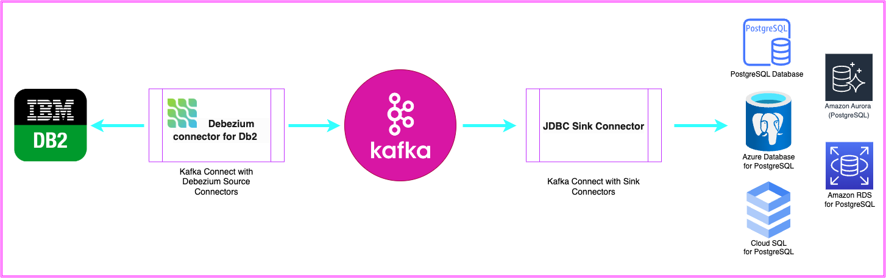

# Migrating Db2 Database to PostgreSQL using Debezium, Apache Kafka® and Apache Kafka® Connect

This repository guides users to migrate databases to open source PostgreSQL with minimal downtime using Debezium.

# How does it work?

Debezium is a powerful open-source Change Data Capture (CDC) platform designed to transform data from existing databases into event streams, enabling applications to promptly detect and respond to changes at the row level within these databases. 

Using Debezium involves three distinct services: ZooKeeper, Kafka, and the Debezium Connector Services:

**ZooKeeper**, as a foundational component, plays a critical role in providing distributed coordination and configuration management that ensures the reliability of the entire system. It serves as the bedrock for maintaining consensus among distributed Kafka brokers, ensuring high availability, and facilitating leadership election within a Kafka cluster.

**Kafka**, another pivotal service, serves as the backbone of the data pipeline, functioning as the distributed message broker for Debezium. Kafka efficiently captures, stores, and delivers the change events emitted by Debezium connectors in real-time.

**The Connector Services**, powered by Kafka Connectors tailored to your source and target databases, act as the bridge connecting your database systems to Kafka. These connectors capture database changes and transform them into a stream of events, which are then fed into the Kafka ecosystem for downstream processing. This processing can include real-time analytics, data warehousing, or data synchronization. Together, these three services create a robust architecture that empowers organizations to harness the full potential of real-time data capture and replication.

# Architecture

The diagram below illustrates the robust Debezium Change Data Capture (CDC) platform, consisting of Kafka and Kafka Connector Services. The Debezium Db2 source connector captures and emits row-level changes from tables as events into their respective Kafka topics. Subsequently, the JDBC Sink connector consumes these events and applies them to the target PostgreSQL database.

Please visit our [Blog](https://thecloudloop.com/?p=2160) for additional details.

